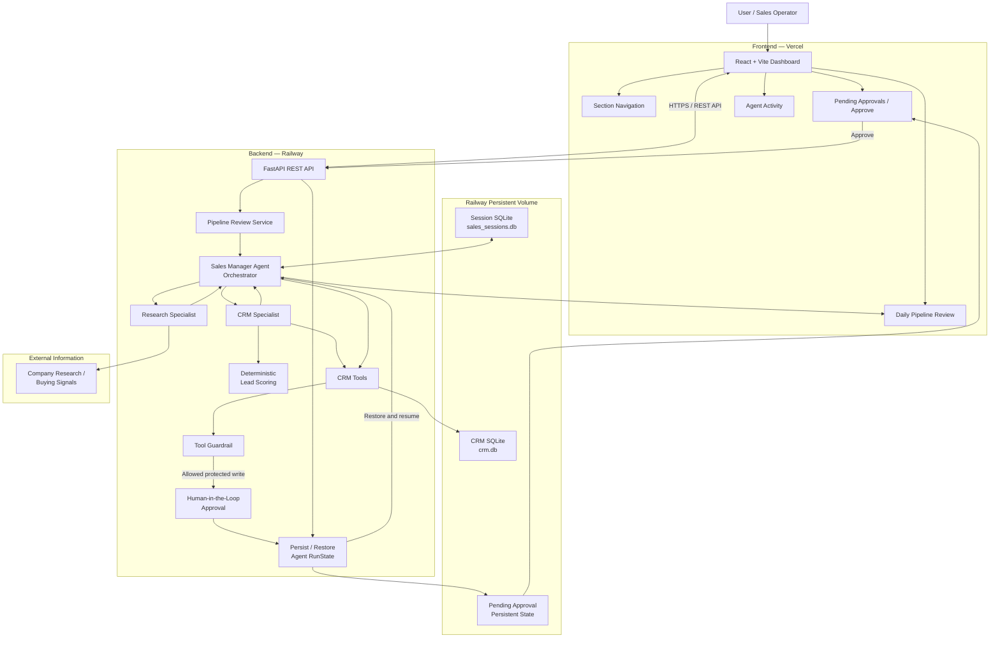

# AI Sales Copilot — System Architecture

[← Back to README](../README.md) | [繁體中文 README](../README.zh-TW.md)

This document describes the current production architecture of the AI Sales Copilot / Autonomous Pipeline Assistant.

The system is designed around three principles:

- Separate deterministic business logic from LLM reasoning
- Keep protected CRM writes behind guardrails and human approval
- Persist important workflow state so interrupted agent runs can survive backend restarts

---

## Production Architecture



---

## Main Read Path

The Daily Pipeline Review follows this general flow:

```text
React Dashboard
      ↓
FastAPI
      ↓
Sales Manager
   ↙          ↘
CRM Specialist   Research Specialist
      ↓                ↓
CRM Data         External Signals
      ↓                ↓
Lead Scoring     Sales Interpretation
   ↘                  ↙
      Sales Manager
           ↓
 Daily Pipeline Review
           ↓
 React Dashboard
```

The final review can contain:

- Top Leads
- Lead Scores
- CRM-based reasons
- Buying Signals
- Sales Interpretations
- Recommended Actions
- Reliability Warnings
- Agent Activity

---

## Protected CRM Write Path

Sensitive CRM-changing operations follow a different path.

```text
Agent requests CRM write
          ↓
     Tool Guardrail
          ↓
   Approval Required
          ↓
 Persist Agent RunState
          ↓
 Store Pending Approval
          ↓
 Human reviews action
          ↓
       Approve
          ↓
 Restore Agent RunState
          ↓
 Resume interrupted run
          ↓
    Execute CRM tool
          ↓
     Update CRM DB
          ↓
 Remove Pending Approval
```

This is intentionally different from a normal tool-calling agent.

The agent does not receive unrestricted permission to perform protected CRM writes immediately.

---

## Guardrail + Human Approval

The system uses two separate control layers:

```text
AI Decision
     ↓
Tool Guardrail
     ↓
Human Approval
     ↓
CRM Execution
```

### Tool Guardrail

The guardrail validates whether the requested action is allowed to continue.

Current demo behavior includes:

```text
proposal
→ allowed to proceed to Human-in-the-Loop approval

won / lost
→ blocked before approval by the configured guardrail policy
```

### Human-in-the-Loop

An action that passes the guardrail may still require explicit human approval before execution.

These two mechanisms solve different problems.

The guardrail applies system policy.

Human approval keeps a person in control of protected business actions.

---

## Durable Approval Workflow

A key design goal is that an approval should not disappear simply because the backend process restarts.

The production flow has been tested as:

```text
Create Pending Approval
        ↓
Persist State
        ↓
Railway Redeploy
        ↓
Pending Approval still exists
        ↓
User opens Vercel Dashboard
        ↓
Approve
        ↓
Restore RunState
        ↓
Resume Agent
        ↓
CRM Write executes
        ↓
Pending Approval cleared
```

This allows the workflow to support:

```text
Interrupt
→ Persist
→ Restart
→ Restore
→ Resume
```

instead of requiring the entire agent execution to remain alive in application memory.

---

## Persistent Storage

The Railway backend uses a Persistent Volume.

Production paths:

```text
CRM_DB_PATH=/data/crm.db
SALES_SESSION_DB_PATH=/data/sales_sessions.db
```

Persistent storage is used for:

```text
CRM Records
Conversation Sessions
Pending Approval State
Interrupted Workflow State
```

This persistence has been tested across Railway redeployments.

---

## Conversation Session Isolation

Agent memory is separated by `session_id`.

Example:

```text
kevin-session-001
      ↓
Conversation about Kevin Chen
      ↓
"What is his budget?"
      ↓
500000
```

A separate session does not automatically inherit this context:

```text
fresh-session-001
      ↓
"What is his budget?"
      ↓
No Kevin-specific context available
```

This prevents separate conversations from automatically sharing agent context.

---

## Deterministic Logic vs. AI Reasoning

The project intentionally does not use an LLM for every decision.

For example:

```text
Structured CRM Data
        ↓
Deterministic Lead Scoring
        ↓
Lead Priority
        ↓
LLM Interpretation
```

The lead score is calculated using business logic.

The AI then interprets the results and creates recommendations.

This separation improves predictability and makes it easier to understand which parts of the system are deterministic and which parts depend on an LLM.

---

## Internal Data vs. External Research

CRM facts and external research are intentionally separated.

```text
Internal CRM Data
       │
       └── Customer facts

External Research
       │
       └── Buying signals

          ↓

Sales Manager combines them
without treating external data
as internal CRM truth
```

The current demo uses **NovaTech as synthetic CRM data**.

The system avoids treating public information about another company with the same name as verified information about the synthetic NovaTech record.

---

## Production Deployment

```text
GitHub
  │
  ├── Frontend
  │      ↓
  │    Vercel
  │
  └── Backend
         ↓
       Railway
         ↓
 Persistent Volume
```

### Frontend

```text
React
Vite
JavaScript
Vercel
```

### Backend

```text
Python
FastAPI
OpenAI Agents SDK
SQLite
Railway
```

---

## Reliability Mechanisms

The current architecture includes:

```text
Structured CRM Data
        +
Deterministic Lead Scoring
        +
Specialized Agents
        +
CRM / External Research Separation
        +
Tool Guardrails
        +
Human Approval
        +
Persistent RunState
        +
Conversation Isolation
        +
Synthetic Data Protection
        +
Post-Approval CRM Verification
```

The project is designed around controlled automation rather than maximum autonomy.

The central architectural question is:

> Which tasks should AI automate, which actions should remain deterministic, and where should a human stay in control?